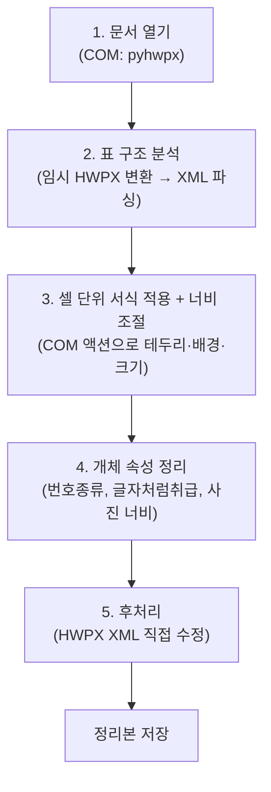

# HWP 표 서식 일괄정리 프로그램 — 프로젝트 개요

## 1. 프로젝트 목적

한글(HWP/HWPX) 문서 안의 **모든 표 서식을 YAML 규칙에 따라 자동으로 통일**하는 보조프로그램입니다.
여러 사람이 편집하거나 여러 출처에서 취합한 문서에서 제각각인 테두리 선 굵기·종류, 셀 배경색, 표 너비 등을 한 번에 정리합니다.

> [!IMPORTANT]
> **핵심 원칙**: 원본 문서는 절대 수정하지 않고, `<원본이름>_정리본.hwp(x)` 사본에만 결과를 저장합니다.

---

## 2. 파일 구성

| 파일 | 역할 |
|---|---|
| `표정리.py` | **메인 실행 파일**. 규칙 파싱 → 표 분석 → 서식·너비 적용 → 후처리까지 전체 파이프라인 |
| `서식규칙.yaml` | 사용자가 편집하는 **서식 규칙 프리셋** (한국어 키) |
| `서식 샘플.hwp` | 표준 서식의 참고용 샘플 문서 |
| `docs/기획서.md` | 프로젝트 기획서 (배경, 설계 결정, 로드맵) |
| `docs/implementation_plan.md` | 너비 조절 기능 구현 계획 (구현 완료) |

---

## 3. 전제 조건

- **Windows** + **한글(한컴오피스)** 설치 필수
- Python 패키지: `pyhwpx`, `pyyaml`
- COM 자동화 방식으로 한글 프로그램을 직접 제어하므로, 한글이 없는 환경에서는 실행 불가

---

## 4. 서식 규칙 (`서식규칙.yaml`) 구조

YAML 파일의 최상위 섹션은 5가지입니다:

```yaml
표서식:          # 일반 표(2행 이상)에 적용할 서식
  너비:          # 문서폭 / 150mm 등 고정값 / 유지
  바깥선:        # 표 외곽 테두리 (위/아래/왼쪽/오른쪽 방향별)
  안쪽선:        # 표 내부 구분선
  머리글행:      # 제목행 배경색, 구분선
  본문셀:        # 나머지 셀 배경 처리 (지우기/유지)

그림틀:          # 1행1열 표 = 그림 감싸기용 (너비, 테두리, 배경, 번호종류)
사진:            # 그림 개체의 번호종류, 너비 (높이는 비율 유지)
개체위치:        # 표/그림의 "글자처럼 취급" 설정
스타일정리:      # x로 시작하는 엑셀 잔재 스타일 제거 여부
```

> [!TIP]
> 선 종류 12가지(`없음`, `실선`, `파선` 등), 선 굵기 16단계(`0.1mm`~`5.0mm`), 색상은 `#RRGGBB` 형식을 지원합니다.
> `너비`는 `문서폭`(편집 영역에 맞춤) / `150mm` 등 고정값 / `유지` 중 선택합니다.
> 잘못된 값(오타 등)을 넣으면 실행 시 어떤 항목이 잘못됐는지 안내하고 중단합니다.

---

## 5. 실행 흐름 (파이프라인)

전체 처리는 크게 **5단계**로 진행됩니다:



### 5.1 문서 열기 · 규칙 로드

- `main()`: CLI 인자 또는 파일 선택 대화상자로 대상 문서 지정
- `process()`: `pyhwpx.Hwp(visible=False)`로 한글을 숨김 모드로 실행, 문서를 열고 `서식규칙.yaml`을 파싱
- `load_rules()`: YAML의 한국어 키를 내부 정수값(선 종류 코드, BGR 색상 등)으로 변환. 잘못된 값은 `규칙오류`로 항목명과 허용 값을 안내

### 5.2 표 구조 분석

- `analyze_tables()`: 열린 문서를 **임시 HWPX로 저장** → ZIP 해제 → `section*.xml` 파싱 → 파싱이 끝나면 원본을 다시 열고 임시 파일을 삭제
- `TableSpec`: 표마다 행/열 수, 셀 병합 정보(`(앵커행, 앵커열) → (행병합, 열병합)`)를 기록
- 1행×1열 표는 `is_1x1` 속성으로 **그림틀**로 구분

> [!NOTE]
> COM API만으로는 셀 병합 구조를 정확히 파악하기 어려워, 임시 HWPX 변환 후 XML에서 `cellAddr`/`cellSpan`을 직접 읽는 하이브리드 방식을 사용합니다.

### 5.3 셀 단위 서식 적용 + 너비 조절 (COM)

- `collect_tables()`: `HeadCtrl`부터 연결 리스트를 순회하며 `tbl` 컨트롤 수집
- `walk_cells()`: `TableRightCell` 액션으로 셀을 하나씩 순회 (병합 셀 중복 방문 필터링)
- `cell_plan()`: 셀 위치에 따라 4방향 테두리와 배경색을 결정하는 핵심 로직
  - 표 가장자리 셀 → 외곽선 규칙 적용
  - 머리글 행 → 머리글 배경색 + 구분선 (단, 본문 행이 하나도 없는 1행짜리 표는 머리글 처리를 하지 않음)
  - 나머지 → 안쪽선 + 배경 지우기
- `apply_cell()`: COM의 `CellBorderFill`/`CellFill` 액션으로 실제 적용
- `format_frame()`: 1×1 그림틀은 4면 동일 테두리 + 배경 제거 + 번호종류 변경.
  적용 전에 실제로 1×1인지 재확인해 분석 결과와 어긋나면 해당 표를 건너뜀
- `get_edit_width()` / `resize_table()`: 규칙이 `문서폭`/`고정값`이면 표·그림틀 너비를 편집 영역 폭(용지폭−좌우여백−제본여백) 또는 지정 mm로 조절.
  표는 `ctrl.Properties`에 Width를 대입해도 적용되지 않으므로(열 너비 합으로 재계산됨) 개체속성 대화상자와 같은 경로인 `TablePropertyDialog` 액션으로 적용하고, 적용 후 실제 너비를 검증

> [!NOTE]
> 분석 결과(표 개수·셀 구조)와 실제 문서가 하나라도 어긋나면 해당 표는 안전하게 건너뛰고 실패로 집계합니다. 실패한 표는 후처리(왼쪽 테두리 색 보정)에서도 제외되어 어중간하게 일부만 바뀌는 일이 없습니다.

### 5.4 개체 속성 정리

- 사진(그림 개체): 번호종류를 `없음(0)`으로 설정, 규칙에 따라 너비 조절(`resize_picture()`, 높이는 가로세로 비율 유지)
- 표/그림 공통: `글자처럼 취급` 속성을 규칙에 따라 일괄 변경
- `set_numbering_type()`: `ctrl.Properties`에서 `NumberingType` 변경

### 5.5 후처리 (HWPX XML 직접 수정)

COM API의 한계를 보완하기 위해 최종 결과물을 HWPX로 저장한 뒤 XML을 직접 수정합니다:

#### 왼쪽 테두리 색 보정
- `compute_left_patches()`: 한글 NEO COM 인터페이스에 **왼쪽 테두리 색 설정 항목이 누락**되어 있는 버그를 보정 (서식 적용에 실패한 표는 제외)
- `patch_left_colors()`: `header.xml`의 `borderFill` → `leftBorder` 색상을 직접 교체 (color 속성이 없으면 추가)

#### x 스타일 제거
- `remove_x_styles_in_hwpx()`: 이름이 `x`/`X`로 시작하는 스타일(엑셀 붙여넣기 잔재)을 삭제하고, 남은 스타일 ID를 다시 매핑
- 삭제된 스타일을 참조하던 문단은 `바탕글(0)`로 연결 (겉모습 유지)

---

## 6. 핵심 기술 결정 및 특이사항

### COM + HWPX 하이브리드 아키텍처

| 단계 | 방식 | 이유 |
|---|---|---|
| 표 구조 분석 | HWPX XML 파싱 | COM으로는 셀 병합 정보를 정확히 얻기 어려움 |
| 서식 적용 | COM 자동화 | 한글 엔진이 직접 처리하므로 결과물 신뢰도 최상 |
| 왼쪽 테두리/스타일 | HWPX XML 직접 수정 | COM API 버그(왼쪽 테두리 색 누락) 우회 |

### 한글 COM API 버그 대응

> [!WARNING]
> 한글 NEO의 `CellBorderFill` 자동화 인터페이스에는 `BorderColorLeft` 항목이 **누락**되어 있습니다(한컴 버그).
> 이 프로그램은 후처리 단계에서 HWPX XML의 `leftBorder` 색상을 직접 패치하여 우회합니다.

### 색상 체계

- 한글 내부: **BGR 정수** (`R + G×256 + B×65536`)
- YAML/사용자: `#RRGGBB` 문자열
- `hex_to_hwp_color()`에서 변환 (형식이 잘못되면 `규칙오류`로 안내)

### 크기 단위

- HwpUnit: 1인치 = 7200 HU (1mm ≈ 283.46 HU), `mm_to_hu()`에서 변환

---

## 7. 사용 방법

```bash
# 방법 1: 더블클릭 → 파일 선택 대화상자
python 표정리.py

# 방법 2: 명령줄에서 파일 지정
python 표정리.py 문서.hwp
```

**출력 결과**: 같은 폴더에 `문서_정리본.hwp` 생성

---

## 8. 기획서 기준 현재 구현 상태

| 기획 기능 | 상태 | 비고 |
|---|---|---|
| F1 서식 규칙 프리셋 | ✅ 구현 | YAML 1개 파일, 프리셋 전환은 미구현 |
| F2 표 서식 일괄 적용 | 🔶 대부분 구현 | 외곽/안쪽선, 머리글행 배경·구분선, 그림틀 지원. 머리글 **글자** 처리(진하게/정렬)는 미구현 |
| F3 글자 서식 일괄 적용 | ❌ 미구현 | 기획서에는 있으나 현재 코드에 없음 |
| F4 일괄(배치) 처리 | ❌ 미구현 | 현재 파일 1개씩만 처리 |
| F5 원본 보호 | ✅ 구현 | `_정리본` 접미사로 사본 저장 |
| F6 변경 리포트 | 🔶 부분 | 콘솔 출력만 (파일 저장 미지원) |
| F7 검사 전용 모드 | ❌ 미구현 | — |
| 너비 일괄 조절 (기획서 외) | ✅ 추가 구현 | 표/그림틀/사진 너비를 문서폭·고정값으로 조절 (implementation_plan.md) |
| 스타일 정리 (기획서 외) | ✅ 추가 구현 | x스타일 제거 |
| 개체 속성 정리 (기획서 외) | ✅ 추가 구현 | 번호종류, 글자처럼취급 등 |

## 9. 알려진 한계

- 다중 구역(section) 문서에서 `문서폭`은 첫 구역의 편집 영역 폭 하나만 사용합니다.
- 중첩 표(표 안의 표)는 분석 순서와 컨트롤 순서가 어긋날 수 있어, 구조가 불일치하는 표는 건너뛰고 실패로 집계합니다. 중첩 표가 많은 문서는 결과 확인을 권장합니다.
- 배포용(암호화)·암호 문서는 열기 실패로 처리됩니다.
